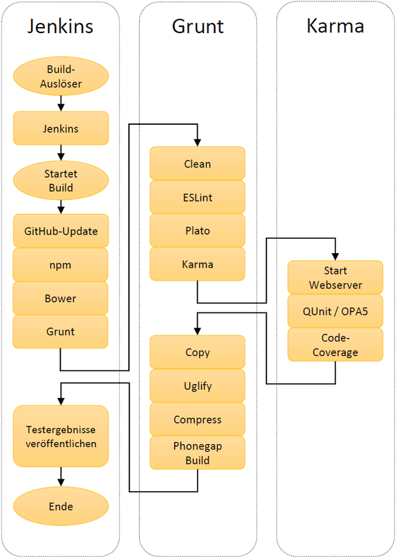
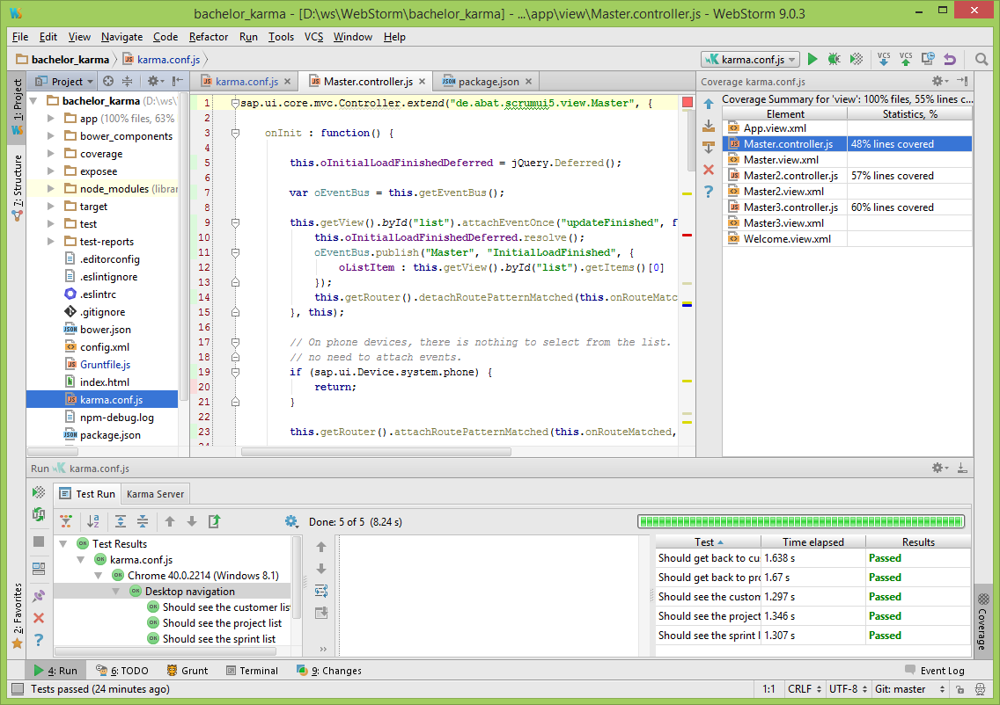

# Test-driven Development and Continous Integration with Hybrid SAP UI5 Apps

Mit aktuellen Tools und Frameworks wie SAPUI5, Gateway und Mobile Platform bietet die
SAP neue Wege zur Entwicklung von geräteübergreifenden Anwendungen.
Bestehende Individualsoftware auf ABAP-Basis wollen wir mit deren Hilfe mobil nutzbar machen.

Gleichzeitig automatisieren wir den testgetriebenen Entwicklungs- und
Auslieferungsprozess. Wir evaluieren entsprechende Open Source Tools und geben Hinweise auf aktuelle Best Practices. Diese umfasen die App-Entwicklung genauso wie OData-Services und ABAP-Backend.

